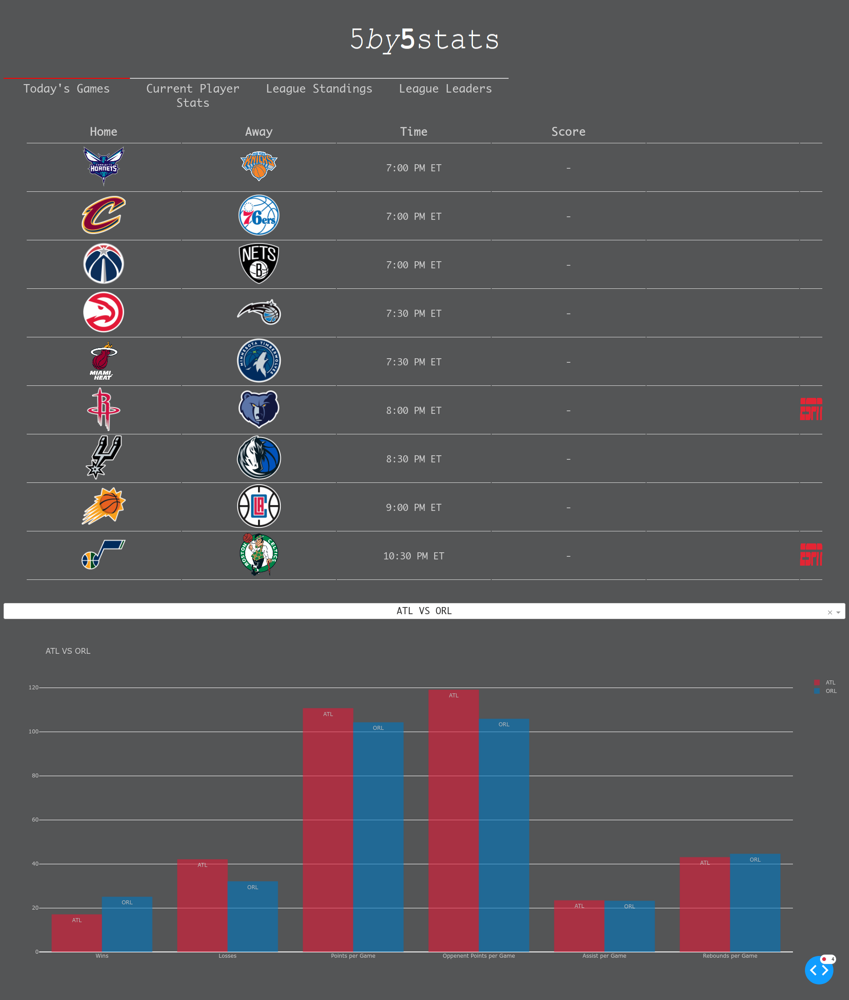
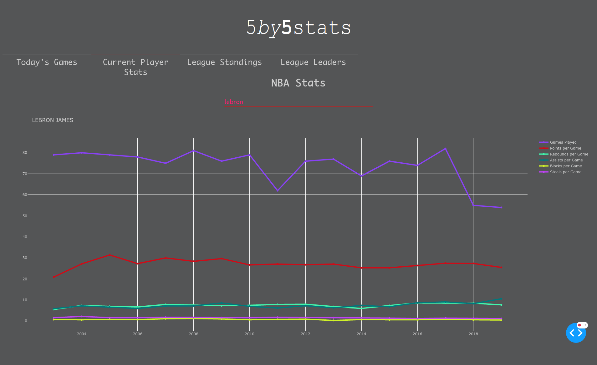
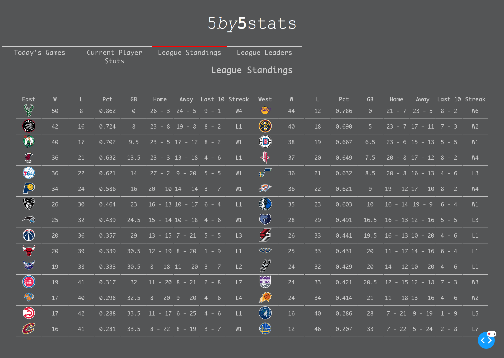
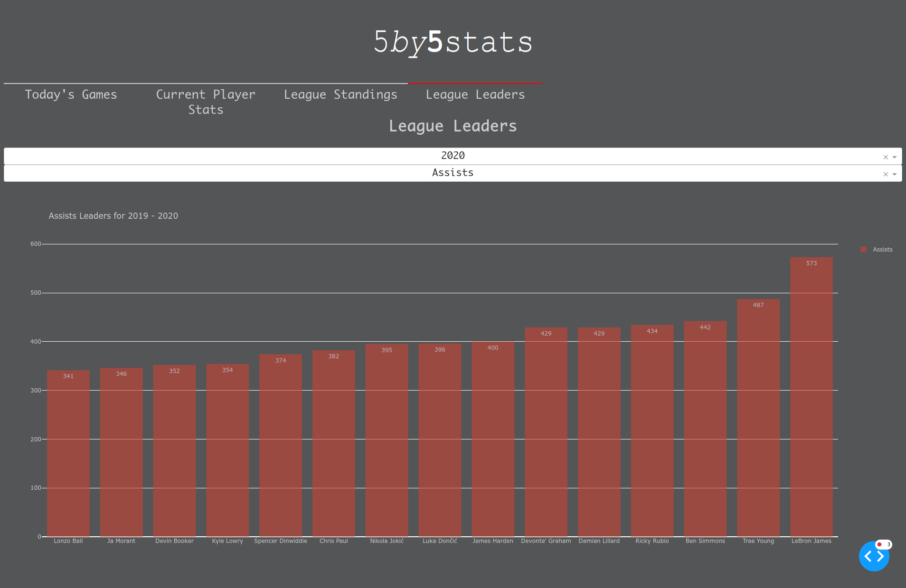

The code in this repo, mainly visualizeNBA.py was the code that powered
5by5stats.com. A pet project that I ran for about a year. I must admit, the code
is very messy and definitely not my best but I think that I gained valuable
experience with this project. I learned about flask, dash, web scraping and
setting up a project on a cloud provider, in this case I used Linode.

To run the project `python3 visualizeNBA.py`

This projects scraped most of the data from [http://data.nba.net/](http://data.nba.net/).

## Screenshots

